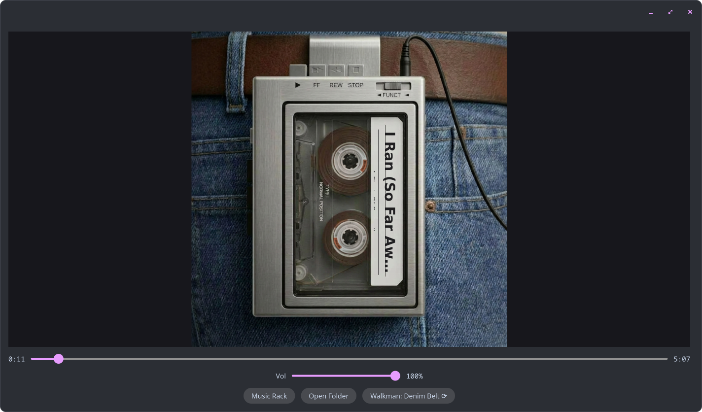
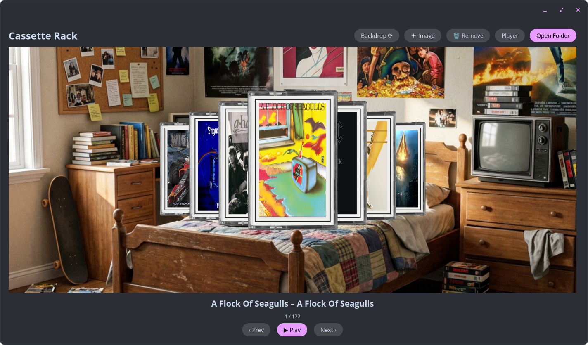
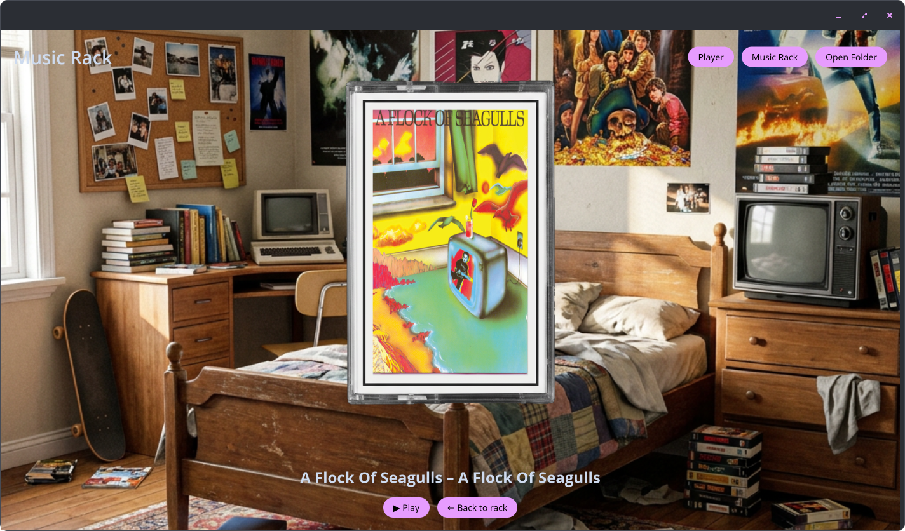
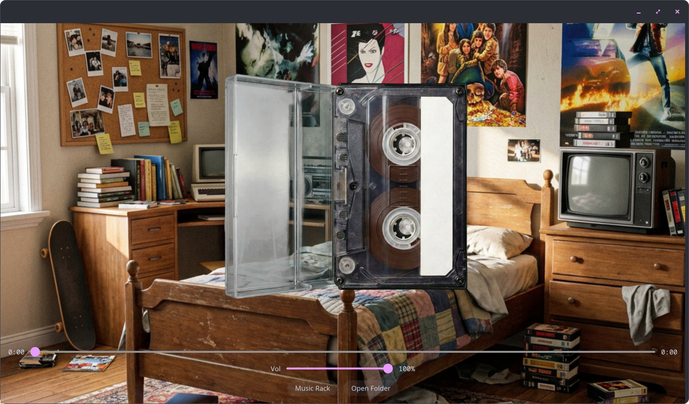
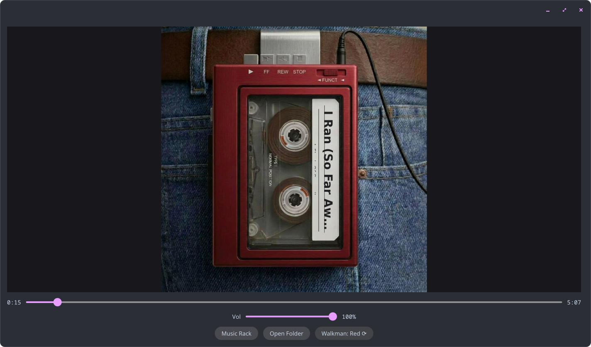

# cosmic-cassette-deck

A photoreal 1980s portable cassette player for your local music library. A native COSMIC desktop app built on libcosmic.

The deck is a photograph, and the app draws the living parts on top every frame: spinning reels with real spool physics, a rasterized track label, and transport keys that travel down into the chassis. Click a cassette case and it swings open, the tape lifts out, and it drops into the walkman. Recolor the deck and swap the room behind it.

<p align="center">
  
</p>

## Features

- Photoreal deck with animated reels driven by physically derived spool speeds. The source reel empties and speeds up while the take-up slows (an area-conserving pack model), and a fixed specular highlight is drawn over each spinning hub the way light stays put on a real deck.
- Case-open and insert animation. On the album screen, click the cassette case: it hinges open, the tape lifts out and drops into the deck, and playback begins.
- Dynamic label. Song and album come from your file tags, rasterized with ab_glyph and rotated (working around iced's lack of rotated canvas text), regenerated on track change rather than per frame.
- Colour skins: Denim Belt, Red, Blue, Black, and White, cycled from the Player.
- Swappable room backgrounds. Cycle the built-ins, add your own image, or remove ones you added. The choice applies to the rack, the album screen, and the insert animation.
- Cassette Rack: a fan-through-your-albums browser with cover art (from tags via lofty, or scraped), navigable with the arrow keys.
- Real player: local files, play, pause, stop, fast-forward and rewind (hold to wind), seek, volume, auto-advance across albums, and session resume.
- Mechanical sound. The transport keys click, the tape seats with a clunk when it drops into the deck, holding fast-forward or rewind whirrs for as long as it is held, and a tape reaching its end clunks to a stop before the next one loads. The cues are short FLAC clips embedded in the binary and are swappable (see Assets).
- MPRIS support for media keys, playerctl, and desktop panel controls.
- Formats: MP3, FLAC, M4A/AAC, and WAV (rodio and symphonia).

## Screenshots

The Cassette Rack fans through your library, one cassette per album, with cover art from your tags (or scraped when a tag has none). Browse with the arrow keys or Prev and Next; Play loads the album at the front.



Click an album to bring its case forward, its cover printed on the J-card. Click the case, or Play, to open it.



The case hinges open, the tape lifts out, and it drops into the deck before playback begins.



Five colour skins cycle from the Player with the Walkman button: the same photographed deck, recolored. The player at the top of this page is the Denim Belt skin; here is Red, playing the same track.



## Building from source

You need the Rust toolchain plus a few system libraries, then a single `cargo` build. There are two ways to get that environment: a normal distro with rustup, or NixOS using the dev shell this repo ships. Both finish at the same build step.

To instead install it as a system package on NixOS (no manual build), skip this section and follow [NIXOS_INSTALL.md](NIXOS_INSTALL.md).

### 1. Clone the repo

```sh
git clone https://github.com/ctsdownloads/cosmic-cassette-deck.git
cd cosmic-cassette-deck
```

Run every command below from inside this `cosmic-cassette-deck` directory.

### 2. Get the toolchain and libraries

**On a normal distro** - install Rust with [rustup](https://rustup.rs), then the system libraries for your package manager:

Debian and Ubuntu:

```sh
sudo apt install build-essential pkg-config libasound2-dev libwayland-dev libxkbcommon-dev mesa-vulkan-drivers
```

Fedora:

```sh
sudo dnf install gcc pkg-config alsa-lib-devel wayland-devel libxkbcommon-devel vulkan-loader
```

Arch:

```sh
sudo pacman -S base-devel pkg-config alsa-lib wayland libxkbcommon vulkan-icd-loader
```

Package names vary, but in all cases you need a C toolchain, pkg-config, ALSA, Wayland, libxkbcommon, and a Vulkan driver plus loader. The app runs under Wayland, and wgpu needs a Vulkan-capable GPU. File dialogs use the XDG desktop portal through rfd; COSMIC already ships xdg-desktop-portal-cosmic, other desktops need their own portal backend.

**On NixOS** - install nothing system-wide. The repo ships a dev shell (as both `flake.nix` and `shell.nix`) carrying the whole toolchain and libraries. Enter it:

```sh
nix develop        # flakes; or `nix-shell` on classic Nix
```

Your shell prompt changes to show you are inside it. Run the next step from in there.

### 3. Build and run

```sh
cargo run --release
```

The first build compiles libcosmic and takes several minutes. It produces the binary at `target/release/cosmic-cassette-deck` - run that directly next time, or `cargo run --release` again. (`Cargo.lock` is committed, so the build is reproducible; only regenerate it with `cargo generate-lockfile` if you change dependencies.)

### 4. First launch

Click **Open Folder** and point it at your music directory. The app scans it recursively, groups files into album cassettes by their tags, and fills the rack. Click a cassette to play it.

## Usage and configuration

State is saved to `~/.config/cosmic-cassette-deck/state`: music folder, volume, current colour skin, chosen and added backgrounds, and the last track and position for resume.

- Player: transport controls, seek, and volume. The Walkman colour button cycles the deck colour.
- Cassette Rack: browse albums with the arrow keys. The backdrop controls cycle, add, and remove the room background. Click an album to open it.
- Album screen: click the case, or the play button, to open it and insert the tape.

### Albums and tracks

Files are grouped into albums by their Artist and Album tags (read with lofty), so each album is one cassette in the rack no matter how many songs it holds, and its tracks play in track-number order. Files with no tags fall back to their `Artist - Title` filename, and each becomes its own single.

Playing a cassette starts at its first song and runs straight through the album, then rolls on to the next cassette on the shelf. To move between songs, use Prev and Next, or slide the FUNCT switch on the deck so fast-forward and rewind step from track to track instead of winding the tape. The label always shows the song that is playing.

## Tech

Rust, libcosmic (its vendored iced fork, wgpu renderer, Wayland and winit), rodio and symphonia (audio decode and playback), lofty (tags and embedded art), ab_glyph (label rasterization), mpris-server (MPRIS D-Bus), rfd (XDG-portal file picker), ureq with image and serde_json (album-art scraping), and tokio.

## Assets

Skin art lives in `assets/`, and the colour skins are recolored variants of the base deck.

Sound effects are FLAC clips in `assets/sfx/`: `key_press`, `tape_seat`, `wind_loop`, and `end_clack`. They are embedded in the binary at build time, so to change the sound, replace a clip with your own recording under the same name and rebuild. Only `wind_loop` repeats; it is stitched seamless in code, so any length works.

## License

[GPL-3.0-only](LICENSE).
